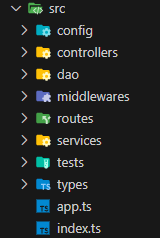
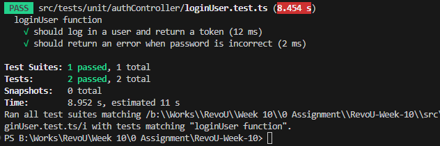
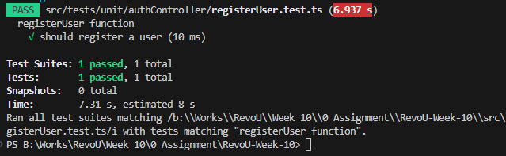
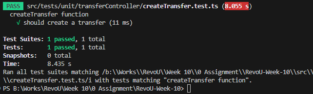
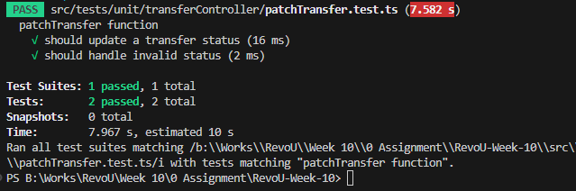

# RevoU Week 10 Assignment

Creates bank transfer application using authentication middleware, service, and DAO.

## Assignment Information

1. Back-end is written using Typescript, ExpressJS, and NodeJS, with MongoDB as NoSQL.

2. There's only 2 roles, maker and approver.

3. Password can only contain alphanumeric with min length of 8.

4. Username cant be blank and has to be unique.

5. Creating API documentation using Swagger.

## Advanced Information - Back-End

1. Create Admin role.

2. Can soft-delete data.

3. Get all transfer must only show the undeleted.

4. Look up History end-point using startDate, endDate, and statuses (rejected, pending).

5. Creates unit testing for Create User, User Login, Create Transfer Request, and Approve Transfer Request.

6. I implemented Data Access Object (DAO) pattern in this project, here's my folder structure:
   
   
   
   1. Config handles ENV configuration.
   
   2. Controllers handle API entry and endpoint (inputs and outputs).
   
   3. DAO handles database connection and query.
   
   4. Middleware handles...well, middleware. Stuff that runs in the middle of process.
   
   5. Routes handles routing of which endpoint (things like "google.com/**api/**").
   
   6. Services handles connection between Controllers and DAO.
   
   7. Tests handles Unit Testing and (possibly) other testings.
   
   8. Types handles Typescript custom interface.

## Unit Testing Results

### loginUser.test.ts:

### registerUser.test.ts:

### createTransfer.test.ts:

### patchTransfer.test.ts:

## API Endpoint

All of API Endpoint can be seen at : [Swagger Documentation](https://adriantori-w10-be.up.railway.app/)

## Deploy Link

Back-end: https://adriantori-w10-be.up.railway.app/api/v1/
